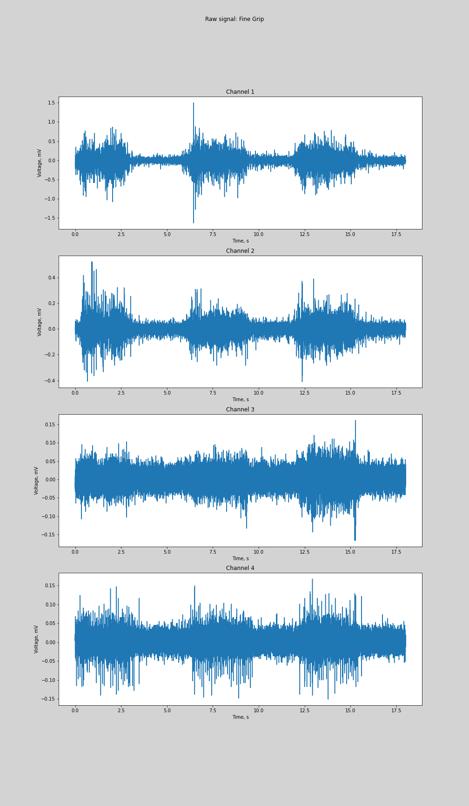
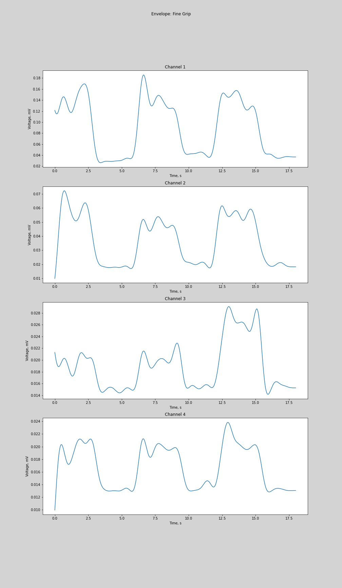

# Signal Processing + AI project: Bionics
Project/research about processig signals, used for bionic prosthetics development.

Project consists of two parts, presented in the [EMG_processing.ipynb](src/EMG_processing.ipynb):
* **I Signal Processing: EMG data processing.** concentrated on processing of the raw EMG data.
* **II AI: Movement classification.** concentrated on classification of EMG signals.

## Problem description:
The main goal of the project was to learn how to properly process myoelectric signals and use them in the problem of motion classification, which is one of the main tasks in the development of bionic prosthetics. 

The task of EMG processing and motion classification itself is a subtask of a wider field - the development of prosthetics for upper and lower limbs. When using biological signals to control prosthetics, companies and independent developers often choose myoelectric signals: these signals are sent by motor neurons and control muscle contraction. After a limb is amputated, neurons continue to send these signals, and, it is possible to record these signals using EMG sensors and use them to control the prosthesis, which replaced the lost limb.

Therefore, my goal was to process ready myoelectric data and classify it. For classification itself I tried different algorithms to be able to compare them in the end.

## Data:
I took the data from the BioPatRec repository. Here is a link to descriptions of their datasets: https://github.com/biopatrec/biopatrec/wiki/Data_Repository.md. Here is a link to the exact dataset that I used in the project: https://github.com/biopatrec/biopatrec/tree/Data_Repository/10mov4chForearmUntargeted. This dataset includes EMG recordings of 20 people. For each person, there are 10 movement recordings available. In total in this data set there are representations of ten basic movements: closing and opening of a hand, turns of a hand, firm grip and side grip, thumbs up, etc. Each movement was repeated by each person three times (for a three-second duration) and with breaks for rest between repetitions (also three-second duration ones). Four bipolar electrodes (each with a diameter of 1 cm and a distance between different electrodes of 2 cm) were connected to the person, so the data is available from four channels. The raw data itself has the following dimensions: Number of samples (36,000 in our case) X Number of channels (4 in our case) X Number of types of movements (10 in our case). Signal sampling frequency: 2 kHz, recording time for each type of movement - 18 seconds. Amplifiers were also used in the measurement, signals were preprocessed using the following filters: high-pass fourth-order filter (at 20 Hz), low-pass second-order filter (at 400 Hz), and also Notch filter (50 Hz). For each person, labels are provided in the same order.

Here is comparison of two processed channels of different signals:

## Pipeline:
Here is a brief pipeline of both parts of the project:

1. Preparations:
    1. Downloading an EMG dataset
    1. Reading data from the data set
1. Processing each signal from the dataset:
    1. Removing mean EMG (making average 0 volts)
    1. Rectification (using absolute values of the signal)
    1. Butterworth low-pass filter for envelope
1. Data analysis and visualizations:
    1. Aplitude spectrum
    1. Spectrogram
    1. Signal processing with visualization
    1. Visual comparison of signals for different movements
1. Feature extraction for classification:
    1. Variance per channel
    1. Number of ZCs (Zero crossing) per channel 
    1. Maximum value per channel
    1. Mean value per channel
1. Classification:
    1. Creating training and testing datasets (k-folds cross-validation)
    1. Decision Tree training
    1. SVM training
    1. KNN training
    1. Naive Bayes training
    1. Neural Network training
    1. Testing models (accuracy, confusion matrix)
    
Implementations are more comments and information on each part of the pipeline can be found in [EMG_processing.ipynb](src/EMG_processing.ipynb).
    
## Results:
Here is comparison of final metrics for different results.
With concatenation:

With handcrafted features:

With separate channels as signals:

## Conclusion:
The best results were achived by SVM for concatentaion and Decision Tree for feature extraction, but even they could not achieve good enough metrics. The problem might be in the little amount of data used, incorrect features extracted or flaws in my classification architecture in general.

## Brief notes for Signal Processing part:
Project consists of two parts: processing EMG signals for Signal Processing course and classifying EMG signals by according hand movements for AI course.

EMG is electromyography, procedure used to obtain myoelectric data. This are recording of signals used by motor neurons to cause muscles to contratc (more information [here](https://www.mayoclinic.org/tests-procedures/emg/about/pac-20393913)).

This signals are frequently used in bionic prosthetics development. More information on myoelectric pattern recognition for bionic upper limb prosthetics [here](https://bionicsforeveryone.com/myoelectric-pattern-recognition-bionic-arms-hands/).

Using EMG we can predict which movement was meant to be performed by the limb, myoelectric data for which was recorded. This is why EMG is used in prosthetics development. In case of my project, I used [dataset 10mov4chForearmUntargeted](https://github.com/biopatrec/biopatrec/wiki/Data_Repository.md), which contained data only for the upper limb and had representations of 10 basic movements.

Here are examples of spectrograms of two signals representing different movements (only one channel for each):

I used a small signal processing pipeline in order to get the data ready for further work (for example, classification).
Here is a little preview of raw data and the final processed signal:

More information about data, processing pipeline, classification and more illustrations are available in the [according jupyter notebook](src/EMG_processing.ipynb).

## Sources/literature:
* **EMG data**
	1. [Myoelectric Pattern Recognition for Bionic Arms & Hands | Bionics For Everyone](https://bionicsforeveryone.com/myoelectric-pattern-recognition-bionic-arms-hands/)
	1. [Electromyography (EMG)](https://www.mayoclinic.org/tests-procedures/emg/about/pac-20393913)
	1. [Electromyogram (EMG)](https://archive.physionet.org/mimic2/Signals_Class/emg.shtml)
	1. [Examples of Electromyograms](https://physionet.org/content/emgdb/1.0.0/)
	1. [Dynamic Brain Platform - Official Site](https://dynamicbrain.neuroinf.jp/database/item/id/EMG101)
	1. [EMG Physical Action Data Set](https://archive.ics.uci.edu/ml/datasets/EMG+Physical+Action+Data+Set)
	1. [Data_Repository.md · biopatrec/biopatrec Wiki](https://github.com/biopatrec/biopatrec/wiki/Data_Repository.md)
	1. [Ninapro info/data](http://ninapro.hevs.ch/)
    
* **Processing EMG with python**
	1. [Python: Analysing EMG signals](https://scientificallysound.org/2016/08/11/python-analysing-emg-signals-part-1/) 
    
* **Regarding EMG feature extraction**
	1. [Interpreting Deep Learning Features for Myoelectric Control: A Comparison With Handcrafted Features](https://pubmed.ncbi.nlm.nih.gov/32195238/)
	1. [Cardinality as a highly descriptive feature in myoelectric pattern recognition for decoding motor volition](https://www.ncbi.nlm.nih.gov/pmc/articles/PMC4625080/)
	1. [Myoelectric control of prosthetic hands: state-of-the-art review](https://www.ncbi.nlm.nih.gov/pmc/articles/PMC4968852/)
    
* **General info about bionic prosthetics**
	1. [A Complete Guide to Bionic Arms & Hands | Bionics For Everyone](https://bionicsforeveryone.com/bionic-arms-hands/#bionic-hands-function)
	1. [A Complete Guide to Bionic Legs & Feet | Bionics For Everyone](https://bionicsforeveryone.com/bionic-legs-feet/)
	1. [Bionic Leg & Foot Control Systems | Bionics For Everyone](https://bionicsforeveryone.com/bionic-leg-foot-control-systems/)
	1. [Bionic Hands: Finding the Right Myoelectric Control System | Bionics For Everyone](https://bionicsforeveryone.com/bionic-hands-finding-the-right-myoelectric-control-system/)
	1. [Bionic Arm & Hand Control Systems | Bionics For Everyone](https://bionicsforeveryone.com/bionic-arm-hand-control-systems/)
	1. [Bionic Arm & Hand Control Systems (myoelectric-dc) | Bionics For Everyone](https://bionicsforeveryone.com/bionic-arm-hand-control-systems/#myoelectric-dc)
	1. [how does a bionic arm work - Open Bionics](https://openbionics.com/how-does-a-bionic-arm-work/)

* **Papers**
	1. https://www.ijedr.org/papers/IJEDR1403083.pdf
	1. (work of Open Bionics, mentions EMG usage for their prosthetics) https://openbionics.org/EMBC2014_Liarokapis_AffordableProstheticFingers.pdf
	1. (work of Open Bionics, describes how EMG sensors can be used) https://www.minasliarokapis.com/2019_RAL_AdaptiveTendonDrivenWearableExogloves.pdf
	1. (work of Open Bionics, describes EMG-based learning scheme) https://ieeexplore.ieee.org/document/6507235
	1. (also discusses EMG pattern-recognition for bionic hands (even homemade ones)) https://www.sciencedirect.com/science/article/abs/pii/S0208521617300323
	1. (this one also discusses MMG) https://www.researchgate.net/publication/301633829_Analyzing_EMG_and_MMG_signals_for_MMG_driven_bionic_arm
	1. https://www.scirp.org/(S(351jmbntvnsjt1aadkposzje))/reference/referencespapers.aspx?referenceid=3008477
	1. https://pubmed.ncbi.nlm.nih.gov/33321915/
	1. https://www.nature.com/articles/s41598-017-09770-5
	1. [EMG Signal Processing for Hand Motion Pattern Recognition Using Machine Learning Algorithms](https://www.scientificarchives.com/admin/assets/articles/pdf/emg-signal-processing-for-hand-motion-pattern-recognition-using-machine-learning-algorithms-20200622090632.pdf)

* **Theses**
	1. https://www.theseus.fi/bitstream/handle/10024/147196/thesis_susan.pdf?sequence=1&isAllowed=y
	1. https://static1.squarespace.com/static/5fdf30e82dcd53187f20b7f4/t/5fe09c7ef5f64226567c5b9e/1608555676841/Low+Cost+Prosthetic+Arm+Thesis.pdf
	1. https://www.youtube.com/watch?v=CIqzeBxkRws
	1. https://digitalcommons.csbsju.edu/cgi/viewcontent.cgi?article=1052&context=honors_theses
* **Other**
	1. [InMoov - open-source 3D printed life-size robot](https://inmoov.fr/)

## Previouslu considered sources:
Possible sources of data (EEG):
 * [EEG Motor Movement/Imagery Dataset](https://archive.physionet.org/pn4/eegmmidb/)
 * article [EEG datasets for motor imagery brain computer interface](https://www.researchgate.net/publication/316690456_EEG_datasets_for_motor_imagery_brain_computer_interface)
 * Materials from "Decoding finger movement in humans using synergy of EEG cortical current signals" paper. Correspondence and requests for materials should be addressed to N.Y. (email: yoshimura@pi.titech.ac.jp) 
 * (? possibly they dont have any linkts to data in this paper, currently I dont see one) Materials from "Investigating Neural Representation of Finger-Movement Directions Using Electroencephalography Independent Components" paper.
 * [Evaluation of EEG Features in Decoding Individual Finger Movements from One Hand](https://www.hindawi.com/journals/cmmm/2013/243257/)
 * [Brain–computer interface robotics for hand rehabilitation after stroke: a systematic review](https://jneuroengrehab.biomedcentral.com/articles/10.1186/s12984-021-00820-8)
 * [EEG Motor Movement/Imagery Dataset 1.0.0](https://physionet.org/content/eegmmidb/1.0.0/S032/S032R13.edf)

## Credits:
* [Daria Omelkina](https://github.com/dariaomelkina)

Special Thanks go to [BioPatRec](https://github.com/biopatrec/biopatrec/wiki/BioPatRec.md) team for making EMG data sets available for free access on the web.